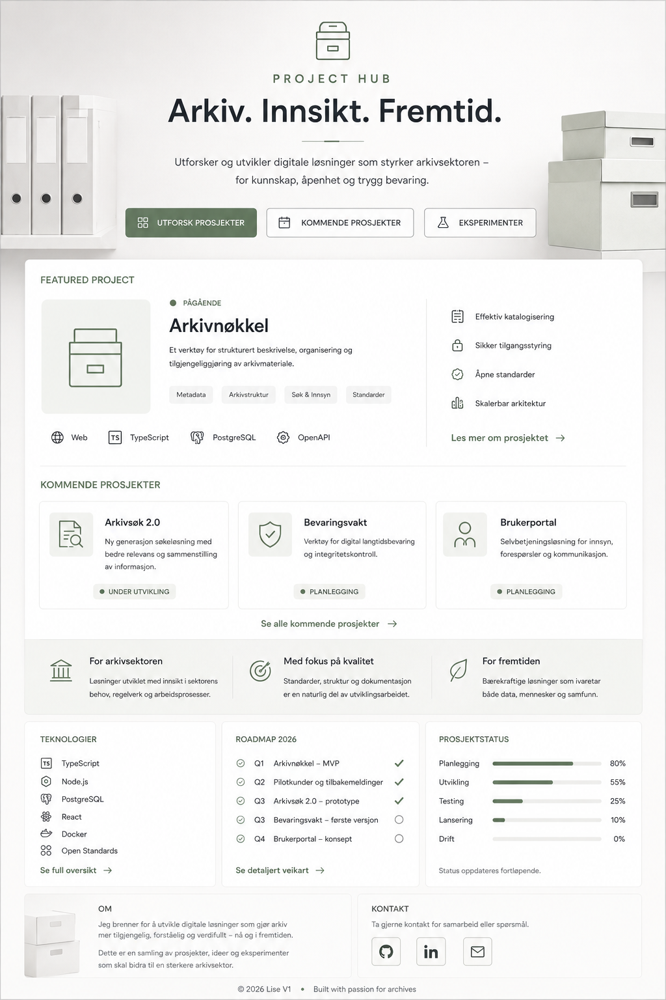

  

# PROJECT HUB

### Arkiv. Innsikt. Fremtid.

**En profesjonell inngangsportal for digitale prosjekter, idéer og løsninger innen arkivsektoren.**

 

<a href="#prosjekter">Utforsk prosjekter</a>
&nbsp;&nbsp;·&nbsp;&nbsp;
<a href="#kommende-prosjekter">Kommende prosjekter</a>
&nbsp;&nbsp;·&nbsp;&nbsp;
<a href="#om-project-hub">Om Project Hub</a>

---

## Prosjekter

<table>
<tr>
<td width="18%" align="center">

### ▤

</td>
<td width="52%">

### Første prosjekt kommer

Project Hub er under etablering. Første prosjekt publiseres her når det er klart for testing og demonstrasjon.

**Status:** `PLANLEGGING`

`Arkiv` `Metadata` `Søk & Innsyn` `Åpne standarder`

</td>
<td width="30%">

**Fokus**

- Struktur
- Tilgjengelighet
- Kvalitet
- Videreutvikling

</td>
</tr>
</table>

---

## Kommende prosjekter

<table>
<tr>
<td width="33%" valign="top">

### Arkivprosjekt 01

Et kommende prosjekt innen digital arkivforvaltning og tilgjengeliggjøring.

**● PLANLEGGING**

</td>
<td width="33%" valign="top">

### Arkivprosjekt 02

Et konsept med fokus på søk, struktur og bedre tilgang til informasjon.

**● IDÉ**

</td>
<td width="33%" valign="top">

### Arkivprosjekt 03

Et fremtidig prosjekt knyttet til bevaring, kvalitet og kontroll.

**● IDÉ**

</td>
</tr>
</table>

---

## For arkivsektoren

<table>
<tr>
<td width="33%" valign="top">

### ⌂ For arkivsektoren

Løsninger utviklet med forståelse for behov, arbeidsprosesser og praksis.

</td>
<td width="33%" valign="top">

### ◎ Med fokus på kvalitet

Struktur, dokumentasjon og standarder er en naturlig del av utviklingsarbeidet.

</td>
<td width="33%" valign="top">

### ◌ For fremtiden

Teknologi som gjør verdifull informasjon mer tilgjengelig og anvendelig.

</td>
</tr>
</table>

---

## Teknologier · Roadmap · Status

<table>
<tr>
<td width="33%" valign="top">

### Teknologier

`HTML`  
`CSS`  
`JavaScript`  
`TypeScript`  
`GitHub`  
`OpenAPI`  
`Åpne standarder`

</td>
<td width="34%" valign="top">

### Roadmap 2026

- ✓ Project Hub
- ✓ Visuell profil
- ○ Første prosjekt
- ○ Interaktiv demo
- ○ Flere prosjektområder

</td>
<td width="33%" valign="top">

### Prosjektstatus

**Planlegging** ████████████████ 80%

**Utvikling** ███████░░░░░░░░░ 35%

**Testing** ██░░░░░░░░░░░░░░░ 10%

**Lansering** ░░░░░░░░░░░░░░░ 0%

</td>
</tr>
</table>

---

## Om Project Hub

Project Hub fungerer som en samlet inngangsportal til nye prosjekter, prototyper og digitale eksperimenter.

Målet er å utvikle løsninger som er **enkle å forstå, praktiske å bruke og mulige å videreutvikle over tid**.

**Idéer → prototyper → testing → ferdige løsninger**

 

© 2026 Lise V1 · Arkiv. Innsikt. Fremtid.

